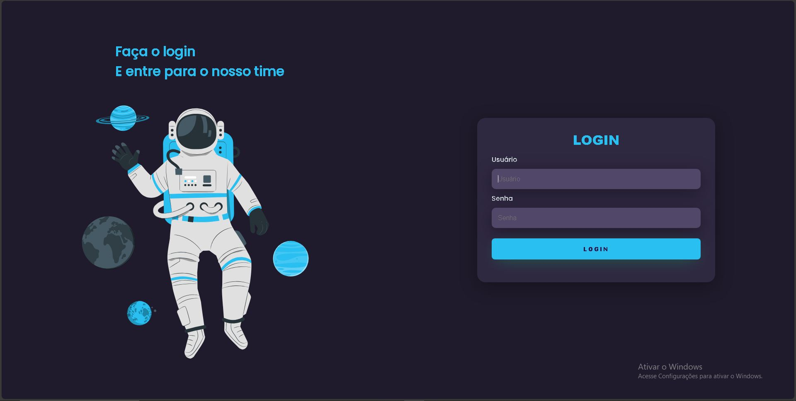

# 🔐 Tela de Login

Projeto de uma **interface de login** simples, criado com foco em praticar estruturação com **HTML** e estilização com **CSS**.

## 🖼️ Preview



## ✨ Tecnologias Utilizadas

- HTML5
- CSS3

## 🎯 Objetivo

- Desenvolver uma tela de login responsiva e visualmente agradável
- Praticar alinhamento, formatação e estilização de formulários

## 🚀 Como Executar

1. Clone o repositório:
   ```bash
   git clone https://github.com/me-lucas-al/tela-de-login.git
